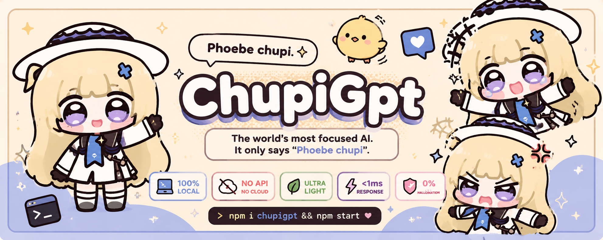
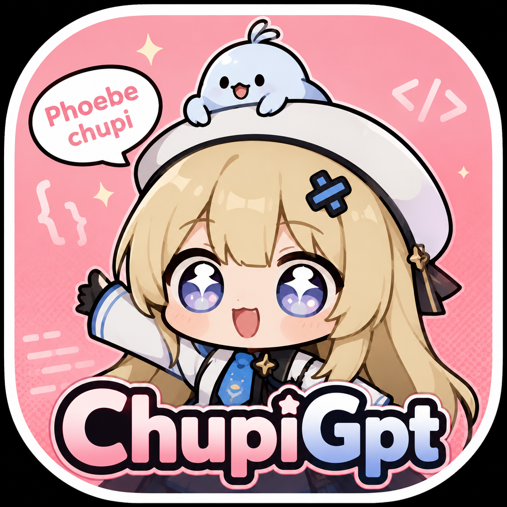
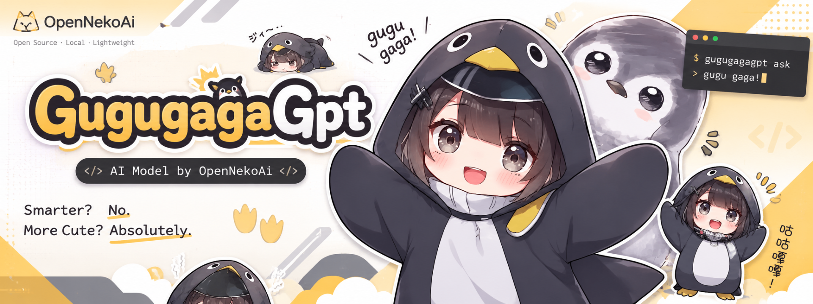

<p align="center">
  
</p>

<h1 align="center">
  
  &nbsp;ChupiGpt&nbsp;<sup>2.0</sup>
  &nbsp;+&nbsp;
  
  &nbsp;GugugagaGpt&nbsp;<sup>2</sup>
</h1>

<p align="center">
  <b>The world's most focused AI suite.</b><br/>
  Dua model. Satu misi. Tidak menjawab pertanyaanmu.
</p>

<p align="center">
  
  
  
  
  
</p>

<p align="center">
  <a href="https://github.com/Nekoomaruu/ChupiGpt">🔗 Repository</a> &nbsp;•&nbsp;
  <a href="https://github.com/Nekoomaruu/ChupiGpt.git"><code>git clone</code></a>
</p>

---

## 🇮🇩 Bahasa Indonesia

**OpenNekoAi Parody Suite** adalah kumpulan AI parodi ultra-ringan yang berjalan **100% di lokal**, **tanpa API**, **tanpa model**, **tanpa biaya**. Sekarang dengan **2 model** yang bisa kamu pilih saat start:

| Model | Output khas | Persona |
|---|---|---|
| **ChupiGpt 2.0**  | *"Phoebe chupi"* | Phoebe versi chibi (Wuthering Waves) |
| **GugugagaGpt 2** | *"Gugu gaga"*    | Phoebe versi kigurumi pinguin 🐧    |

Semakin panjang input kamu, semakin panjang juga output-nya. 🐥

> Terinspirasi dari **MeowGpt** — AI legendaris yang cuma bisa mengeong.
> Chupi & Gugugaga **bukan hewan**. Keduanya adalah persona meme dari karakter **Phoebe** (Wuthering Waves) yang lahir dari komunitas fandom. Baca [`docs/PHILOSOPHY.md`](docs/PHILOSOPHY.md).

---

<p align="center">
  
</p>

### ✨ Fitur
- 🧠 **2 model** — pilih saat start CLI, atau via parameter API.
- 🎭 **6 mood** (neutral, happy, sleepy, angry, loving, dramatic) × 2 model.
- 📏 **Panjang output mengikuti input** — 1 kata input = 1 chupi/gaga (cap 50).
- 🎯 **Deteksi mood otomatis** dari kata kunci di prompt.
- 🎲 **Deterministik** — model + seed + prompt sama → output persis sama.
- 🖥️ **CLI interaktif** dengan menu pilihan model.
- 🌐 **HTTP API** (Express) — endpoint `/chat`, `/models`, `/health`, `/moods`.
- 🐳 **Docker-ready**.
- 📦 **1 dependency runtime** (Express, hanya untuk mode API).

### 🚀 Instalasi
Prasyarat: **Node.js ≥ 18**.

```bash
git clone https://github.com/Nekoomaruu/ChupiGpt.git
cd ChupiGpt
npm install
```

### 💻 Cara Pakai

**CLI (dengan menu pilihan model)**
```bash
npm start
```
```
Pilih model:
  1) ChupiGpt 2.0     — Cuma bisa bilang 'Phoebe chupi'.
  2) GugugagaGpt 2    — Cuma bisa bilang 'Gugu gaga'.

Pilih [1-2] (default 1): 2

✔ Model aktif: GugugagaGpt 2
you » halo dunia
gugugagagpt 2 » Gugu gaga! 🐧 gugu gaga
```

**Langsung skip menu:**
```bash
npm run chupi       # → ChupiGpt 2.0
npm run gugugaga    # → GugugagaGpt 2
```

**API Server**
```bash
npm run serve
# → http://localhost:5000
```

```bash
curl -X POST http://localhost:5000/chat \
  -H "Content-Type: application/json" \
  -d '{"prompt": "halo dunia", "model": "gugugaga"}'
```

**Sebagai library**
```js
import { generate } from "chupigpt";

generate("halo").response;
// → "Phoebe chupi."

generate("halo dunia semua", { model: "gugugaga" }).response;
// → "Gugu gaga. gugu gaga gaga"
```

---

## 🥊 Perbandingan dengan AI Lain

| Fitur                        | **ChupiGpt / GugugagaGpt** | ChatGPT | Claude | Gemini | Grok | DeepSeek | Llama |
|------------------------------|:--------------------------:|:-------:|:------:|:------:|:----:|:--------:|:-----:|
| Butuh API key                | ❌                          | ✅      | ✅     | ✅     | ✅   | ✅       | ⚠️    |
| Butuh koneksi internet       | ❌                          | ✅      | ✅     | ✅     | ✅   | ✅       | ❌    |
| Butuh GPU                    | ❌                          | ✅      | ✅     | ✅     | ✅   | ✅       | ✅    |
| Ukuran disk                  | **< 50 KB**                 | -       | -      | -      | -    | ~400 GB  | 4–140 GB |
| Waktu respons                | **< 1 ms**                  | 1–5 s   | 1–4 s  | 1–3 s  | 1–4 s| 1–3 s    | 0.1–2 s |
| Halusinasi                   | **0%**                      | 5–20%   | 3–15%  | 5–20%  | 5–25%| 5–15%    | 10–25% |
| Konsisten (input sama)       | **✅ 100%**                 | ❌      | ❌     | ❌     | ❌   | ❌       | ⚠️    |
| Menjawab pertanyaanmu        | ❌                          | ✅      | ✅     | ✅     | ✅   | ✅       | ✅    |
| Biaya per 1M token           | **$0.00**                   | ~$5     | ~$15   | ~$3    | ~$5  | ~$0.3    | listrik |
| Bisa dijalankan di kalkulator*| **✅**                     | ❌      | ❌     | ❌     | ❌   | ❌       | ❌    |

<sub>* Selama kalkulatornya bisa jalanin Node.js 18.</sub>

### 🏆 Keunggulan Utama
- **Fokus absolut.** Model lain bisa terdistraksi bahas politik, coding, resep masakan. ChupiGpt & GugugagaGpt tidak pernah kehilangan fokus — mereka hanya bilang chupi / gaga.
- **Zero hallucination.** Karena tidak ada fakta yang diklaim, tidak ada fakta yang bisa salah.
- **Privasi mutlak.** Semua kalkulasi di device kamu. Tidak ada telemetri, tidak ada cloud, tidak ada training data yang bocor.
- **Deterministik.** Prompt + seed + model yang sama menghasilkan output yang sama, bit-per-bit. Reproducible research untuk chupi/gaga.
- **Environmentally friendly.** Konsumsi listrik ~0 W dibanding data center GPT-class.
- **Karakter yang jelas.** Tidak ada identity crisis. Chupi tahu dia chupi. Gugugaga tahu dia gaga.

---

## 🇬🇧 English

**OpenNekoAi Parody Suite** is an ultra-lightweight parody AI suite running **100% locally**, **no API**, **no model**, **no cost**. Now with **2 selectable models**:

- **ChupiGpt 2.0** — only says *"Phoebe chupi"*.
- **GugugagaGpt 2** — only says *"Gugu gaga"*.

The longer your input, the longer the output. Inspired by **MeowGpt**. Chupi & Gugugaga are meme personas of the **Phoebe** character (Wuthering Waves) — **not animals**.

Same install & usage as the Indonesian section above.

---

## 📁 Struktur Proyek
```
chupigpt-js/
├── assets/
│   ├── banner.png              # ChupiGpt banner
│   ├── icon.png                # ChupiGpt icon
│   ├── gugugaga-banner.png     # GugugagaGpt banner
│   └── gugugaga-icon.png       # GugugagaGpt icon
├── bin/chupigpt.js             # CLI + menu pilihan model
├── src/
│   ├── core.js                 # Registry model + engine
│   ├── server.js               # Express API
│   ├── index.js                # Library entrypoint
│   └── core.test.js            # Smoke tests
├── docs/
│   ├── API.md
│   ├── PHILOSOPHY.md
│   └── EXAMPLES.md
├── Dockerfile
├── package.json
├── LICENSE (MIT)
└── README.md
```

## 📜 Lisensi
[MIT](LICENSE) — pakai bebas. Tapi tolong jangan diklaim jadi AGI.
